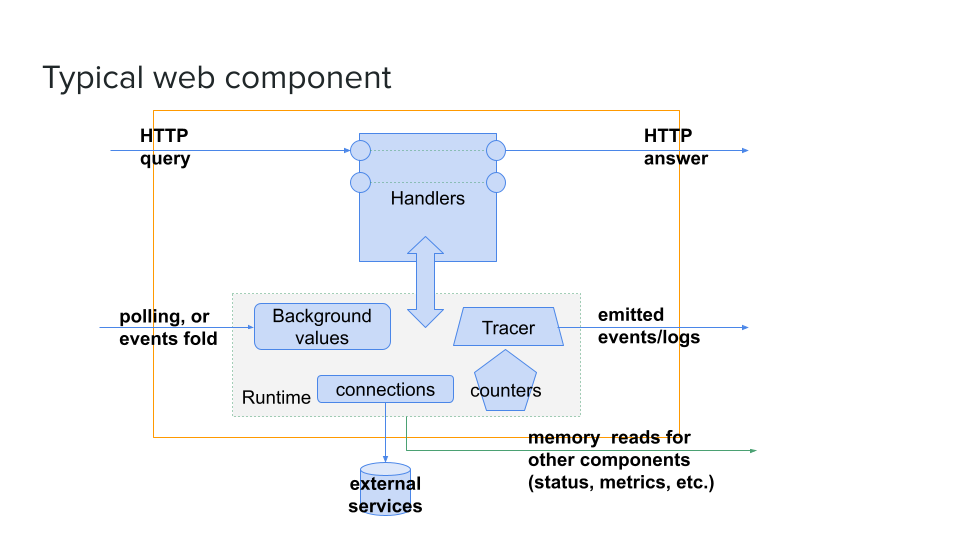
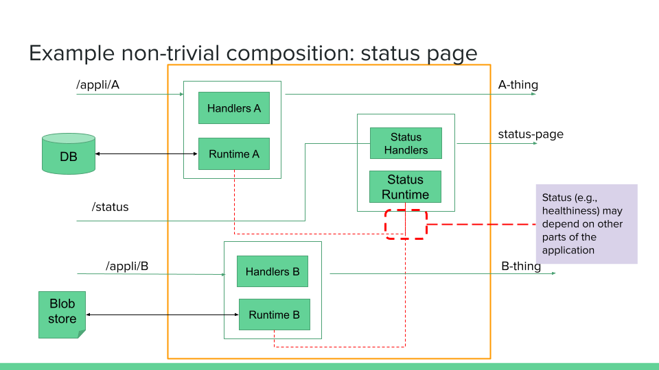
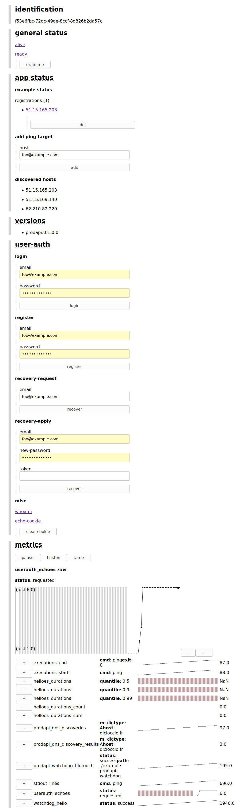

prod-api
========

A simple curation libraries for building Haskell services.

# Guiding principles

- developpers should be aware of monitoring and operability concerns
- however, the bar to entry should be low
- favor direct code rather than indirections
- use advanced type-system features tactically

## Applications are built of components

### Components and composition

There only are vague definitions for what components are. We focus on
long-running services such as APIs, schedulers, monitoring systems rather than
one-shot jobs like compilers or command-line pipeline components.

In a typical web component, a developper would have to define:
- *handlers* some web-API handlers implementing some business rules
- *background values* some background jobs shared among all handlers
- *traces* some emitted information (e.g., for logging or notifications)

Further, to help operability of the system, the developper is well-advise to also define:
- *counters*, both for technical and business-specific operations monitoring
- *status pages* for operators (e.g., to display information or provide actions that cannot be built in a centralized monitoring center)
- *healthiness* conditions (i.e., requesting to stop receiving more requests)

Graphically, we can think of a component as a large box containing an ecosystem
of tightly-coupled piece of code with intricate and application-specific logic.



The picture shows Handlers, Background Values, Counters, and Tracers. 
This picture also shows connections to external services, albeit such
connections could be considered as background values.  Further, the picture
wraps all of Counters, Tracer, Background Values, Connections in a box named
*Runtime*. A Runtime is merely a convention which can help maintain some
homogeneity between components: typically a Runtime is instantiated once at
startup.

The picture, omits Status pages and Healthiness: indeed these two features
actually are implemented in other component (for instance, there can be only
one handler for a standard `/status` HTTP endpoint for the whole web-API). The
component responsible for building the actual status page would actually read
one of the Background Value. In short, we need to plug components together.

The following picture displays a way of thinking about a component composed of
other components. In particular, it shows how the Status components "connects
internally" (via reading in-memory variables) to runtimes of two other
application-specific components.



It helps to think that a composition of components form a new component. However,
we reckon that components typically compose pretty badly:
- web handlers will compose in parallel
- runtime initialization typically requires a complicated (monadic) sequence which is application and component specific
- tracer handlers can be collated together in a gigantic sum type and then split towards different sinks; sometimes they need some other runtime (e.g., to trace events into some queue)

As a result, we provide little "component" abstraction, rather, we let users of
libraries come with what work with them. What works for the author is to pay
some boilerplate collating multiple components together, and tactically use
type-informed composition like the Monoid instance for the Status page.

### Code organization conventions

Typical applications would benefit from separating code in a few components.
Components are good candidate for splitting into separate services.

A small component could be written in a single file, however larger components
deserve some file-organization. A proposed organization is as follows.

```
  MyService/Base.hs
     # Defines the base types useful for your application.
     # This module can also serve to write some pure domain-logic functions.

  MyService/Counters.hs
     # Defines a datatype with all Prometheus counters.
     # Also provides some helper functions to set/update some counters.

  MyService/Background.hs
     # Defines background jobs and watchdogs for mutable and shared contexts of handlers.

  MyService/Trace.hs
     # Defines a datatype with the component-specific tracing information.

  MyService/Runtime.hs
     # Defines input parameters as well as runtime values such as connection to
     # databases, or background-updated values.

  MyService/Api.hs
     # Defines the service API using Servant.

  MyService/Handlers.hs
     # Combines all the above and implements the proper handlers.

  MyService.hs
     # Re-exports the important stuff to facilitate imports.
```

Further, we prefer to export names like `Runtime` and let users do [qualified imports](https://wiki.haskell.org/Import_modules_properly) for disambiguation in the glue code.

# Provided APIs and library curation

The idea of `prodapi` is not to be normative but to let people pick what they
like (the author will be happy, even in an extreme case where 'what they like'
means 'picking some concepts and re-using no lines of code'). The provided components
are here have one of either reasons:
- to help normalizing and homogeneizing a way of writing components and applications
- help bootstrap projects with typically annoying bricks (monitoring, primitive user-auth) sorted out

## defining APIs with Servant
- encourages the use of Servant to declare and implement handlers (offered components use Servant in a way or another)
- servant offers a number of generators, the `prodapi-gen` package will offer generators for common cases (deriving orphan instances locally to the package if needed)

## echo
- enables to test round-trips
- see [gen/docs/docs-echo.md](gen/docs/docs-echo.md)

## health-checking
- normalizes whether an application is up or not
- see [gen/docs/docs-health.md](gen/docs/docs-health.md)

## status
- identification, healthiness
- helpful /status page
- status-page is customizable forcing Lucid
- see [gen/docs/docs-status.md](gen/docs/docs-status.md)

## metrics
- exposes counters over [Prometheus](http://prometheus.io/)
- a PuresScript-made interactive visualizer (in `/backend-tools` and provided compiled in `www/metrics.js`)
- see [gen/docs/docs-prometheus.md](gen/docs/docs-prometheus.md)

## client-reporting
- simple API for clients to dial-in some timestamped logs (e.g., session digests, errors)
- see [gen/docs/docs-reports.md](gen/docs/docs-reports.md)

## primitive authentication
- PostgreSQL minimal identity management
- JWT claims in a Cookies
- Servant Combinators for Cookie-Protection
- see [gen/docs/docs-user-auth.md](gen/docs/docs-user-auth.md)

## logging and events emission
- promotes the use of contravariant logging to avoid forcing an early choice on library users

## background values and watchdogs
- ways to spawn asynchronously-updated values
- special case of watchdogs which touch a prometheus counter on success
- special case of discoveries for background values that locate addresses (e.g., DNS lookups)

# Example

The `/example` directory serves as a demo: it features a putative monitoring
application which has some background values (discoveries, watchdog touching a
file), a handler to register and perfom _pings_ to target addresses.
Modifying the registered targets requires some authenticated account.
Counters and logs track well the behavior of the application.

A status page collates (cf. screenshot below) displays a lot of useful
information and even has some HTML forms to easily operate some of the
endpoints.

.

# TODO

- curation choices for leader-elections
- curation choices around argument-parsing
- scaffolder
