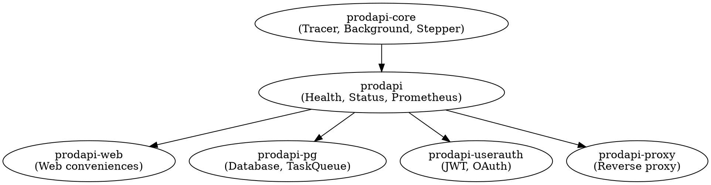

# PRODAPI Architecture

## Overview

PRODAPI is a curated framework for building production Haskell services. It emphasizes:

- **Operability**: Built-in health checks, metrics, and status pages
- **Composability**: Components that can be combined into larger systems
- **Type Safety**: Leveraging Haskell's type system for correctness
- **Low Barriers**: Simple patterns that don't require advanced expertise

## Core Philosophy

### Component-Based Architecture

A component is a self-contained unit with:
- Handlers (web API endpoints)
- Background values (shared mutable state)
- Tracers (logging)
- Counters (metrics)
- Status pages (operability)
- Health conditions (liveness/readiness)

Components compose badly by design - web handlers compose in parallel, runtime initialization is sequential, and tracers need collation. Rather than forcing a composition abstraction, PRODAPI provides patterns and conventions.

## Package Architecture

### Layer 0: Core (prodapi-core)

Minimal dependencies, no web framework.

```haskell
-- Prod.Tracer: Contravariant logging
newtype Tracer m a = Tracer { runTracer :: (a -> m ()) }

-- Prod.Background: Async state management  
data BackgroundVal a = ...

-- Prod.Stepper: Lightweight state machines
type StepIO a b = ...
```

**Rationale**: These primitives are useful even without web services (e.g., background workers, CLI tools).

### Layer 1: Base (prodapi)

Full feature set including Servant and Prometheus.

```haskell
-- Health checking
Prod.Health - Runtime, Liveness, Readiness

-- Status pages
Prod.Status - HTML/JSON status with Lucid

-- Metrics
Prod.Prometheus - Counter management

-- Utilities
Prod.Watchdog - File-monitoring background tasks
Prod.Discovery - DNS-based service discovery
Prod.Echo - Testing endpoints
Prod.Reports - Client log collection
```

### Layer 2: Web (prodapi-web)

Web-specific conveniences and re-exports from prodapi.

### Layer 3: Extensions

- **prodapi-pg**: PostgreSQL utilities and task queues
- **prodapi-userauth**: JWT-based authentication
- **prodapi-proxy**: Reverse proxying
- **prodapi-gen**: Documentation generators

## Key Design Patterns

### 1. Contravariant Tracing

```haskell
-- Define your trace events
data DatabaseTrace 
    = QueryStarted Query
    | QueryCompleted Query Duration
    | QueryFailed Query Error

-- Create a tracer
tracer :: Tracer IO DatabaseTrace
tracer = traceBoth 
    (contramap toLogMsg tracePrint)
    (contramap toMetric prometheusTracer)

-- Use it
runTracer tracer (QueryStarted q)
result <- executeQuery q
runTracer tracer (QueryCompleted q duration)
```

**Benefits**:
- No upfront commitment to logging backend
- Multiple consumers via `traceBoth`
- Transform with `contramap`
- Filter with `traceIf`

### 2. Background Value Pattern

```haskell
-- Periodic cache refresh
cacheVal <- backgroundLoop 
    cacheTracer
    mempty  -- initial empty cache
    fetchFromDatabase
    60_000_000  -- 60 seconds

-- In handler
currentCache <- readBackgroundVal cacheVal
```

**Benefits**:
- Non-blocking reads
- Automatic updates
- Tracked via `Track` type
- Linkable with `link` for crash propagation

### 3. Health Runtime Pattern

```haskell
-- Create runtime
runtime <- alwaysReadyRuntime healthTracer

-- Add custom readiness check
let runtime' = runtime 
    { readiness = checkAll [dbHealthy, cacheHealthy]
    }

-- Dynamic conditions
afflict runtime' (Reason "maintenance_mode")
-- ... later ...
cure runtime' (Reason "maintenance_mode")
```

**Benefits**:
- Kubernetes-compatible probes
- Dynamic condition management
- Stack traces on affliction
- Composable readiness checks

### 4. Status Page Monoid

```haskell
-- Define sections
healthSection :: RenderStatus a
healthSection = defaultStatusPage $ 
    \_ -> pure ()  -- use default health rendering

customSection :: RenderStatus MyState
customSection = \_ st -> do
    h2_ "Queue Depth"
    p_ (toHtml $ show $ queueDepth st)

-- Combine
fullPage :: RenderStatus MyState
fullPage = healthSection <> customSection
```

**Benefits**:
- Sections compose with `(<>)`
- Type-safe HTML with Lucid
- JSON and HTML from same definition
- Default implementations for common cases

## Runtime Structure

```
┌─────────────────────────────────────────┐
│           Application                   │
│  ┌─────────────────────────────────┐   │
│  │         Runtime                 │   │
│  │  ┌─────────┐  ┌──────────────┐ │   │
│  │  │ Health  │  │ Background   │ │   │
│  │  │ Runtime │  │ Values       │ │   │
│  │  └─────────┘  └──────────────┘ │   │
│  │  ┌─────────┐  ┌──────────────┐ │   │
│  │  │ Tracer  │  │ Connections  │ │   │
│  │  │ Sink    │  │ (DB, HTTP)   │ │   │
│  │  └─────────┘  └──────────────┘ │   │
│  └─────────────────────────────────┘   │
│                                         │
│  ┌─────────────────────────────────┐   │
│  │         Handlers                │   │
│  │  (Servant Server)               │   │
│  └─────────────────────────────────┘   │
└─────────────────────────────────────────┘
```

## Data Flow

### Request Flow

```
HTTP Request
    │
    ▼
Servant Routing
    │
    ▼
Handler
    │
    ├──► BackgroundVal (read) ──┐
    │                           │
    ├──► Health.afflict/cure    │
    │                           │
    └──► Tracer (emit event)    │
    │                           │
    ▼                           │
Response ◄──────────────────────┘
    │
    ▼
HTTP Response
```

### Background Update Flow

```
┌─────────────┐     ┌─────────────┐
│   Timer     │────►│    Task     │
│  (async)    │     │  (update)   │
└─────────────┘     └──────┬──────┘
                           │
                    ┌──────▼──────┐
                    │   IORef     │
                    │  (current)  │
                    └─────────────┘
                           ▲
                           │ read
                    ┌──────┴──────┐
                    │   Handler   │
                    └─────────────┘
```

## Component Composition Example

The example application (`/example`) demonstrates composition:

```haskell
-- Monitors.Counters: Prometheus counters
-- Monitors.Background: Discovery and watchdogs  
-- Monitors.Handlers: API implementation
-- Hello: Simple component

-- Main wires them together:
main :: IO ()
main = do
    -- Initialize components
    helloRuntime <- initHello
    monitorsRuntime <- initMonitors
    
    -- Shared status page
    let statusPage = combineStatus 
            [ helloStatus helloRuntime
            , monitorsStatus monitorsRuntime
            ]
    
    -- Combined health
    let healthRuntime = combineHealth
            [ helloHealth helloRuntime
            , monitorsHealth monitorsRuntime
            ]
    
    -- Start server
    runApp statusPage healthRuntime handlers
```

## Module Dependency Graph



## Extension Points

### Adding a New Background Task Type

1. Define trace type
2. Create initializer function
3. Implement cleanup (kill/link)

### Adding a New Health Check

1. Define check function: `IO Readiness`
2. Compose with existing: `<>` (monoid)
3. Register with runtime

### Adding a New Status Section

1. Create `RenderStatus a` function
2. Use Lucid HTML combinators
3. Compose with existing sections

## Anti-Patterns to Avoid

1. **Don't** create deep monad transformer stacks
   - Use plain IO with explicit context passing
   
2. **Don't** abstract components too early
   - Accept some boilerplate in composition code
   
3. **Don't** block in background tasks
   - Use delays and timeouts appropriately
   
4. **Don't** ignore tracer contravariance
   - Use `contramap` for transformations, not wrappers

## Related Documentation

- `docs/AI-CONTEXT.md` - Quick reference for AI assistants
- `README.md` - Project overview and principles
- `gen/docs/*.md` - Feature-specific API documentation

